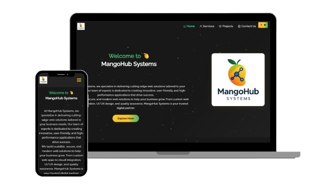

<h2 align="center">
  MangoHub Systems - v2.0<br/>
  <a href="https://mangohub.vercel.app/" target="_blank">mangohub.vercel.app</a>
</h2>

<div align="center">
  
</div>

<br/>

<p align="center">
  <a href="https://forthebadge.com">
    
  </a>&nbsp;
  <a href="https://forthebadge.com">
    
  </a>&nbsp;
  <a href="https://forthebadge.com">
    
  </a>&nbsp;
  
  
</p>

<h3 align="center">
  🔹 <a href="https://github.com/MangoHubSystems/MangoHub_Systems/issues">Report Bug</a> &nbsp; &nbsp;
  🔹 <a href="https://github.com/MangoHubSystems/MangoHub_Systems/issues">Request Feature</a>
</h3>

---

## 🚀 About MangoHub Systems

**MangoHub Systems** is a full-stack platform built to showcase and deliver modern, scalable, and responsive web applications using technologies like **React**, **Spring Boot**, and **Tailwind CSS**. This portfolio demonstrates our work, services, and professional skillset.

## 🛠 Built With

This project uses:

- React.js
- Spring Boot
- Tailwind CSS
- Firebase & Firestore (for authentication and storage)
- React Bootstrap
- Vercel (for deployment)
- Visual Studio Code

## ✨ Features

- 📖 Multi-Page Layout
- 🎨 Beautiful UI with Tailwind CSS and Bootstrap
- 🔐 Firebase Authentication
- ⚙️ Firestore-based dynamic content
- 📱 Fully Responsive Design
- 🧑‍💻 Admin-ready project structure

## 📦 Getting Started

Clone this repo and install the dependencies.

```bash
git clone https://github.com/MangoHubSystems/MangoHub_Systems.git
cd MangoHub_Systems
npm install
```

🌐 Live Website
https://mangohub.vercel.app
